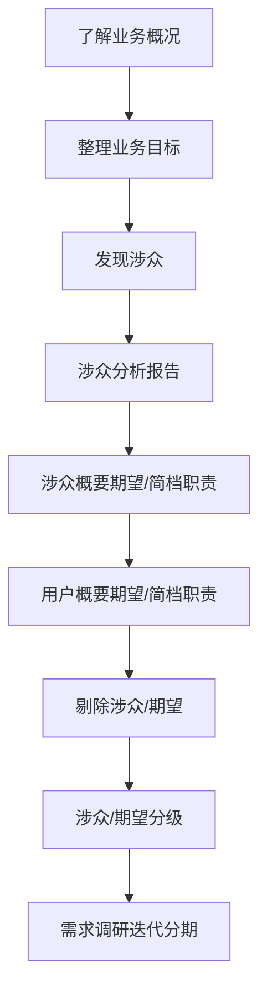
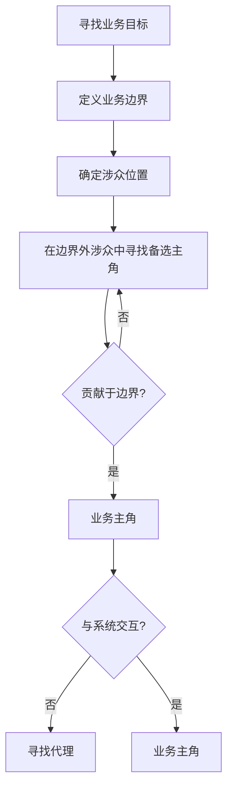

[TOC]

## 软件建模过程梳理

### 总览

本篇整理了如何通过UML的设计规范来进行软件构建的过程和注意点，需要的基础知识如下

- 软件设计和体系结构概念
- UML表示法概述

软件建模过程分为三个阶段：需求建模/分析建模/设计建模

### 建模过程

#### 需求建模

需求可分为**功能性需求**和**非功能性需求**，举例说明：希望增加产品导出是功能性需求，希望这个功能的响应时间是2秒则是非功能性需求。

需求建模的过程：需求分析->需求规约->用例

在将系统需求转化之前，

需求分析的第一步，从参与者和系统的关系入手。

关于参与者的概念，你需要了解：

- 参与者是代表在**系统之外**和系统**交互**的**某人或者某物**，是从一类人或者事物上抽象泛化出的概念。

- 参与者从**干系人**（涉众）中筛选出来，不同的是，干系人与系统利益相关，同时也包括不直接参与系统操作的一类人。比如运营分析人员，从系统导出业务报表，整合给老板看。老板和运营都是干系人，同时运营也是参与者。
- 角色则是将参与者的**一些职责/能力**进行整合之后抽象，进行命名得出的**抽象概念**。
- 用户是参与者的实例，是参与者的实际代表。
- 用户可以实际获得某些角色。
- 执行某一项业务时，在业务之内参与业务的参与者，我们称为**业务工人**，在业务之内，主导业务的参与者，我们称为**业务主角**。业务主角是确认业务范围的重要工具。*业务范围大于系统范围，系统范围是指通过软件实现的业务功能，而业务范围包含了所有的客户业务，拿柜台存款业务举例，系统范围可能包括，电脑提供的存款/核对等服务，在这个例子下，办理业务的，是业务主角，柜员则是业务工人。*

**如何确定边界**：边界既是**分析工具**也是**设计工具**

边界就是**范围**，站在不同的抽象层次上对需求进行业务分析，可以有效降低复杂度。

##### 用例建模 （用例图/活动图）

用例建模的表示法有下面三个：

用例的组成概念：用例-前置条件-用例场景-后置条件

**用例**表示**参与者**与**系统交互**的**可观测**的一系列**活动**

**用例场景**是用例的**实例**，表示用例的不同情况

用例的特点：

- 相对独立。它的粒度是大的，能独立满足参与者意愿的，功能完备的。
- 可观测，有意义。（后台进程对于业务参与者，输入密码对于参与者，前者是参与者不可观测，也没有意义，后者是没有完整意义）
- 必须有参与者发起。
- 用例的内容是动宾短语
- 用例是接下来分析工作的单元

用例的粒度：？

用例的获取：访问整理需求。用例的分类：**业务用例，概念用例，系统用例**。

用例图、活动图、文档化用例

问题域建模步骤

##### 第一步、了解问题领域

发现涉众的按照下面几个关键角度分析

业主-->业务提出方-->业务管理者-->业务执行者—>第三方-->用户

涉众/期望 都有类似的分级方式，分别按照核心-参与-边缘分为3个等级

理解现有的业务模块按照3个层次  业务架构 -- 业务流程 -- 工作细则 3个等级来理解业务。

**访谈技巧:**

1. 做好准备工作
   1. 了解业务规则
2. 以我为主
   1. 要有明确的谈话目标
3. 把握需求节奏
   1. 把握需求层次（依据需求调研计划）
4. 记录与反馈

##### 第二步、定义边界->寻找业务主角

##### 第三步、获取业务用例

获取业务用例的过程是通过访谈业务主角、角色扮演获取、不同角色视角、角色扮演提炼的，可以根据业务用例划分工作量。

##### 第四步、业务建模

业务用例到业务场景到业务场景实现，活动图指明职责、通信图强调时序、交互图强调交互

##### 第五步、领域模型

##### 1、提出领域问题

##### 2、根据问题代入业务用例场景，尝试从业务对象中获取领域对象

##### 3、领域代入涉及到的业务用例场景中验证、调整领域对象之间的关系

##### 4、建立领域模型静态模型

##### 5、通过领域模型动态图验证领域对象

##### 第六步、业务规则、非功能性需求

#### 需求分析

概念模型-建立业务架构-开发系统原型

1. ##### 创建业务用例组成的业务主线

2. ##### 寻找关键业务用例的必要组成，是为概念用例

3. ##### 针对概念用例创建概念用例场景图

4. ##### 从概念场景图中获取概念用例对象

5. ##### 使用概念用例对象创建对象交互图解释主流业务。

#### 分析建模

##### 系统建模

1. 确定系统用例

   1. 什么是系统用例？

      系统用例是描述一次完整的人机交互的用例。

   2. 系统用例从哪里来？

      系统用例从业务用例中提炼，抽象、拆分、合并而来的，系统建模从业务建模中来

   3. 系统用例、建模有什么用？

      系统用例是系统需求的一次完整表述，提供了业务到系统实现的可追溯，逻辑完整性。为开发人员提供了交流的纽带。

      系统用例建模过程很好的划分了为了达成业务目标时，业务主角和计算机的职责范围。

2. 分析业务规则

   1. 系统业务规则从哪里来
      1. 从业务用例，系统用例的场景分析中提炼出来，
      2. 业务规则又分为全局（跨用例）、业务规则（跨用例场景）、内敛规则（仅在用例内）
   2. 为什么要分析业务规则‘
      1. 业务规则往往代表了代码逻辑，将业务规则进行提炼，抽离能有效的防止因为业务规则的变化导致的程序变更，提高程序的健壮性和生命力。
   3. 怎么提炼业务规则
      1. 业务规则来自对于用例场景的分析，可以分为全局规则，业务规则，内敛规则。全局规则交由系统层面的设计实现，业务规则通过设计模式、业务规则引擎，内敛规则则封装或则提炼成方法或则类。

建模骚操作  **用例获取-》用例对象图、用例场景图-》场景动态建模（活动图、时序图、交互图）**

`TIP`:订单系统的优惠券计算规则也算是业务规则，可以放到业务规则库中。

##### 系统用例到分析模型

1. 从系统用例到用例实现再到分析模型的转变依据？

   系统用例实现代入软件架构分析，以计算机实现导向。

2. 分析模型包含了什么东西？

   分析模型包含分析类（边界类，控制类，实体），分析类的活动图。

3. 分析模型是怎么来的？

   1. 前置条件，系统用例模型（系统用例，系统用例实现，系统用例活动图、对象图、时序图）已经建立。
   2. 软件架构已经明确。
   3. 系统用例实现场景代入软件架构，以系统用例实现为指导，一次表现每个分析类的方法，属性。
   4. 分析每个软件层次的分析类。
   5. 进入设计阶段。

4. 软件架构由什么组成？

   软件架构包含了软件层次、职责描述、通信协议。

5. 组件建模

   1. 目前不重要，看过就算了。

#### 设计建模

从分析模型到设计模型，我们的工作有哪些？

应用关系分析模型中的关系，对应到设计模型即可，有时为了功能的明确，我们还需要对分析类到设计类的拆分，整合。

最后的设计模型包含了那些东西？

设计类的类图，类图的关系模型，交互模型。接口、包

设计模型是不是就等于系统的实现？

不等于。

接口设计包含的工作内容？

包的设计满足自顶向下（软件架构），职责集中、互不交叉。不基于用例的包单独分出，但是也要满足层级关系。

实体的关系可以不基于用例，但是应该有面向用例、服务的VO层。

什么是好的接口设计？

可以对相似的行为设计接口、也可以为一同一类的业务处理流程设计接口，也可以基于编码方便设计接口。

##### 静态建模（结构视图/类图）

类图的组成

- 业务实体（class）

  业务实体从用例中来，业务实体代表角色执行业务用例时所处理或使用的”事物“。是在参与完成任务目标的过程中被创建出来。

  根据上面的定义，当创建业务实体的时候，我们需要把抽象视角缩短到用例的各个场景下，列举出参与这个场景的名词实体，去除没有直接价值的实体，剩下的就是基础的业务实体列表，接下来，确定实体之间的的关联，属性。不用担心在一个关于业务实体的属性和关联关系分析的不完整，只需要确定当前抽象层次下，这三个内容完备即可。

- 包

  包用来分类整理元素，包内元素紧密关联，同时又具有相同的元素，使得包可以整理出接口代表包内元素和包外元素交互，是为高内聚。

  包内的元素修改变更，不会影响其他包的变更，是为低耦合。

  包之间的关系是单向依赖。

- **分析类**

  分析类是需求走向计算机实现的第一步。

  分析类用于产生系统的设计类和子系统。

  分析类的注意点：

  - 高于实现方式
  - 高于语言实现
  - 高于设计要求

  分析类的组成：

  - 边界类   

    边界类是对象之间交互的建模，可以是任意的实现：程序、服务器、一组API。边界类介于系统和主角之jj间。对于系统的输入，边界类对象是主角的代理；对于系统的输出，他是系统的代理。

  - 控制类

    控制类来源于**用例场景**中对象之间的动作进行的建模。

    控制类起到**协调对象**的作用。

  - 实体类

    实体类来源于业务实体，多数时候是业务实体的直接转化，后续可能会对业务实体继续进行拆分。实体类主要处于数据数据持久层。

- 设计类

    - 设计类可以直接映射到实现代码

##### 对象建模  (对象图)　

##### 动态交互建模 (通信图、顺序图、有/无状态图,活动图)

##### 状态机建模（状态图）

#### 设计建模

在描述完软件的问题域之后，就是解域的描述

就是设计软件体系结构

根据不同的系统特性分了很多体系结构。

##### 面向对象

##### 客户端/服务端

##### 面向服务

##### 基于组件

##### 并发、实时系统

##### 软件产品线

#### 总结

#### 实验1、MindMap系统:Catalina

##### 业务目标：

- 生成知识概念图谱，快速获取文章内容。

##### 涉众分析：

- 用户

  对于知识碎片化感到迷茫的人，需要通过一个软件/工具来管理知识概念

##### 涉众分析报告：

| 编号  | 名称 | 说明           | 期望                                                         |
| ----- | ---- | -------------- | ------------------------------------------------------------ |
| SH001 | 用户 | 主要的使用用户 | ①可以对一篇资料生成概念图 ②通过计算机获取概念标识之间的关系 ③概念面积大小表示权重 ④每一个概念都可以展开形成新的概念图 |

##### 消费者统计

| 消费者名称 | 消费者概况和特点                   | 应用环境       | 使用频率                                         | 特殊要求 |
| ---------- | ---------------------------------- | -------------- | ------------------------------------------------ | -------- |
| 普通用户   | 用户分布在上班族/大学生/文字工作者 | 广域网、互联网 | 没有特定的使用时间和使用频率，基本上每天都有需求 |          |

期望规划

①SH001-对一篇资料的期望，修改为对一个百度百科词条。

②权重用相同的词的出现概率来标识。

| 期望                               | 优先级 |
| ---------------------------------- | ------ |
| 对一篇百度百科词条生成概念图       | 3      |
| 概念图的大小表示权重               | 2      |
| 每一个概念图可以展开形成新的概念图 | 1      |

#### 定义边界

边界1：生成知识概念图谱，快速获取文章内容。

用户是主要的参与者，系统主要实现用户的需求。也是主要的业务主角。

#### 获取用例

1、对系统有什么期望，怎么帮到你？

我希望系统能帮我快递阅读一个百度百科，系统能帮我建立知识图谱。

2、打算在这个系统里面做些什么事

我想要输入一个百科的词条的时候，如果系统的，系统显示爬取多个链接，并以链接为中心词，画出图谱，如果词出现的多，那么这个词就大一点，图谱的关系，我可以像思维导图一样开进行编辑。

3、做这件的事情是为了达到什么目的？

我可以快速的

4、有一个什么结果。

图谱